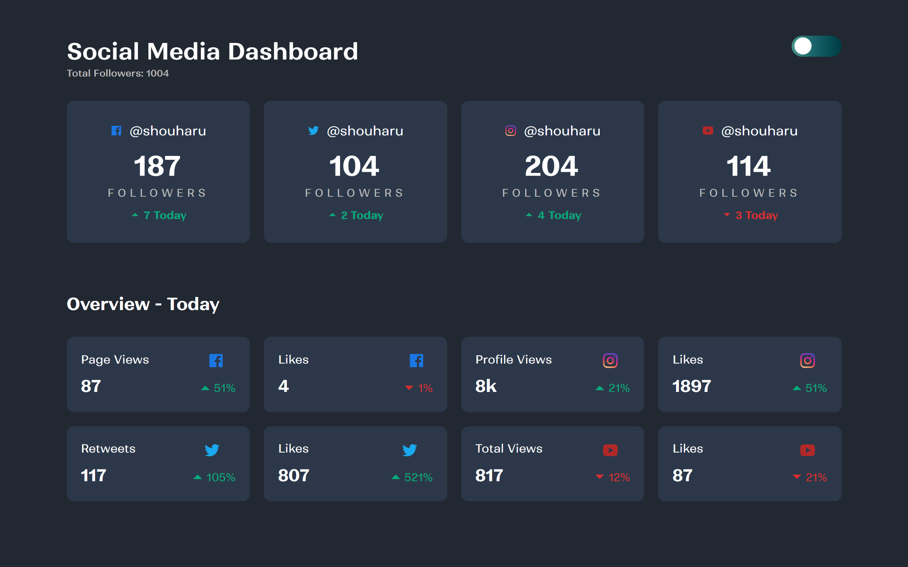

# Frontend Mentor - Social media dashboard with theme switcher solution

This is a solution to the [Social media dashboard with theme switcher challenge on Frontend Mentor](https://www.frontendmentor.io/challenges/social-media-dashboard-with-theme-switcher-6oY8ozp_H). Frontend Mentor challenges help you improve your coding skills by building realistic projects.

## Table of contents

- [Frontend Mentor - Social media dashboard with theme switcher solution](#frontend-mentor---social-media-dashboard-with-theme-switcher-solution)
  - [Table of contents](#table-of-contents)
  - [Overview](#overview)
    - [The challenge](#the-challenge)
    - [Screenshot](#screenshot)
    - [Links](#links)
  - [My process](#my-process)
    - [Built with](#built-with)
    - [What I learned](#what-i-learned)
    - [Useful resources](#useful-resources)
  - [Author](#author)

## Overview

### The challenge

Users should be able to:

- View the optimal layout for the site depending on their device's screen size
- See hover states for all interactive elements on the page
- Toggle color theme to their preference

### Screenshot



### Links

- Solution URL: [Add solution URL here](https://your-solution-url.com)
- Live Site URL: [Live Site in Netlify](https://socialmedia-dashboard-ui.netlify.app/)

## My process

### Built with

- Semantic HTML5 markup
- Flexbox
- CSS Grid

### What I learned

Using CSS Grid has been such a helpful tool for me.

```css
.social-grid {
  display: grid;
  grid-template-columns: repeat(4, 1fr);
  grid-gap: 20px;
  margin-top: 30px;
}
```

### Useful resources

- [Lenis](https://lenis.darkroom.engineering/) - This helped me for the smooth scrolling.
- [FontShare](https://www.fontshare.com/) - This is an amazing to find fonts. I would recommend it to anyone who is learning CSS and wants to find inspiration for typography.
- [RemixIcon](https://remixicon.com/) - This is an amazing icon pack. I would recommend it to anyone who is learning CSS and wants to find inspiration for icons.

## Author

- Website - [Aradhana Nayak](https://re-myproject-gallery.vercel.app/)
- Frontend Mentor - [@aradhana1807](https://www.frontendmentor.io/profile/aradhana1807)
- Github - [@aradhana1807](https://github.com/aradhana1807)
